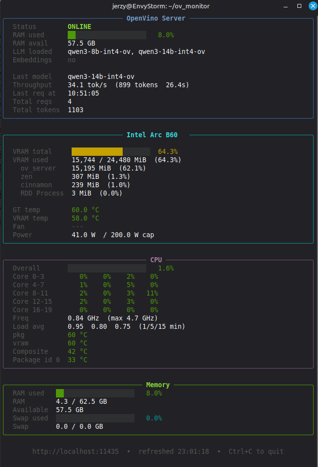

# ov_monitor

Real-time GPU monitor for Intel Arc on the `xe` kernel driver. Displays engine utilisation, VRAM usage per process, power draw, temperature, and fan speed in a terminal UI.

## Why this exists

`intel_gpu_top -J` is broken on the `xe` driver on recent kernels. This is the workaround.

The monitor reads directly from `/proc/<pid>/fdinfo` and Linux `hwmon` sysfs — no root required, no broken tools in the way.

## What it shows

- **Engine utilisation** — render, compute, copy, video engines — derived from `drm-cycles` / `drm-total-cycles` fdinfo counter deltas between polls
- **VRAM usage** — per process, from `drm-total-vram0` in `/proc/<pid>/fdinfo`; total used summed across all xe consumers when debugfs is unavailable (no root needed)
- **Power** — derived from `energy1_input` delta between polls via hwmon
- **Temperature** — GPU die temp via hwmon
- **Fan speed** — RPM via hwmon; shows `---` when sysfs read unavailable

## Requirements

```bash
python3 -m venv .venv
source .venv/bin/activate
pip install -r requirements.txt
```

## Running

```bash
source .venv/bin/activate
./ov_monitor.py
```

Or directly if the shebang is set:

```bash
./ov_monitor.py
```

Exit with `Ctrl+C`.

Minimum terminal width: **70 columns**. Below that, the monitor shows an error message rather than garbled output.

## Hardware probe scripts

Two probe scripts were used to map this machine's hardware and validate the monitoring approach. Useful as reference if you're adapting the monitor to different hardware.

**`probe_b60.sh`** — enumerates Intel Arc B580 DRI paths, fdinfo entries, engine names, and hwmon nodes. Run this first on a new machine to identify your hwmon index and confirm which fdinfo fields are available.

**`probe_vram.sh`** — dumps raw VRAM-related fdinfo fields for all xe processes. Used to confirm `drm-total-vram0` is the right field and that per-process values are readable without root.

Raw output from these probes on the development machine lives in `notes/` — useful for comparing against your own hardware.

## Debug script

**`debug_generate.py`** — tests `openvino_genai` `generate()` return type directly. Confirmed that `pipe.generate()` returns a plain `str` on openvino-genai 2026.x (not a structured object). Used during ov_server development; kept here as a reference diagnostic.

## Hardware context

Developed and tested on:

| Item | Value |
|---|---|
| GPU | Intel Arc B580 (Battlemage, `0xe211`) |
| Driver | `xe` kernel driver |
| Kernel | 6.17.0 OEM |
| OpenCL ICD | 25.18 |
| OS | Linux Mint 22.3 |

The Arc B580 (Battlemage, released Nov 2024) requires kernel ≥ 6.11 and compute runtime ≥ 25.x. Keeping drivers current is non-optional — this GPU is not yet in any LTS kernel's stable support window.

`GPU.0` = Intel UHD Graphics 770 (iGPU). `GPU.1` = Arc B580 (dGPU). The monitor targets the dGPU.

## Notes on the xe driver and debugfs

Some system-level VRAM stats (`vram0_mm`) live in debugfs and require root. The monitor does not require root — it falls back to summing per-process fdinfo values when debugfs is unavailable.

The xe driver registers processes under different DRI paths depending on how they initialised the GPU. Scanning `/proc` directly (rather than reading a clients list from a specific DRI path) is the only reliable way to find all xe consumers — including inference processes that register under a non-obvious path.

hwmon index (`hwmon5` on the development machine) is hardware-specific. Use `probe_b60.sh` to identify the correct index on your machine.
